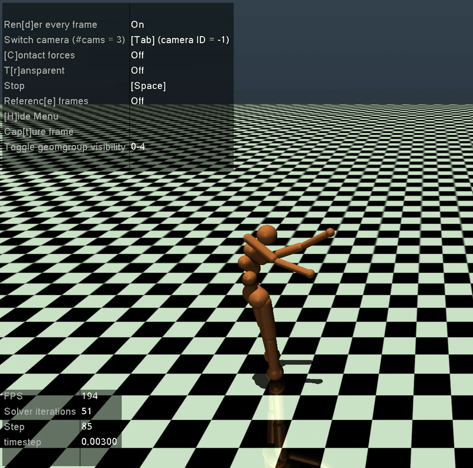
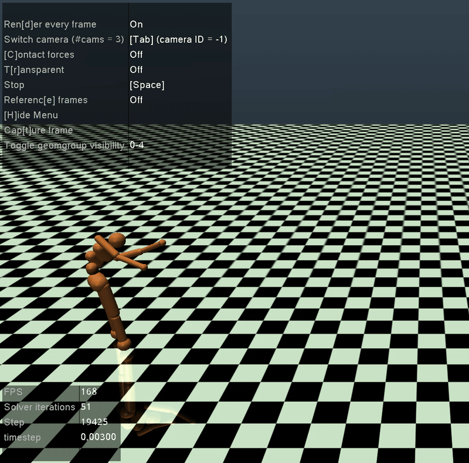

# TD3 with SB3 for OpenAI Gym's Humanoid-v5 environment

Solution to OpenAI Gymnasium's Humanoid-v5 environment, using TD3 (Twin Delayed Deterministic Policy Gradient) with StableBaselines3.

The hyperparameters used for this experiment are:

| **Param**    | **Value** |
| -------- | ------- |
| *Environment*    | Humanoid-v4    |
| *SB3 Policy*  | MlpPolicy (T3 Policy)    |
| *Learning Rate* | 0.0003     |
| *Buffer Size*    | 1e6    |
| *Batch Size*    | 256    |
| *Gamma*    | 0.99    |
| *Tau*    | 0.005    |
| *Policy Delay*    | 2    |

The results obtained for episodes 1000, 3000 and 4500 are shown below. Although the robot is not able yet to run naturally on episode 4500, previous work show that this algorithm solves with good performance the given RL problem. By episode 10K (after 15M timesteps) the agent should be able to run at higher speed, even though it will not have a human-like motion.

---

## Agent after 1000 episodes

---

## Agent after 3000 episodes

---

## Agent after 4500 episodes

---
